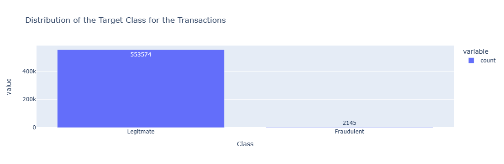
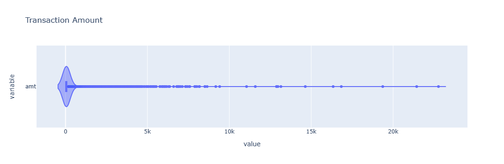
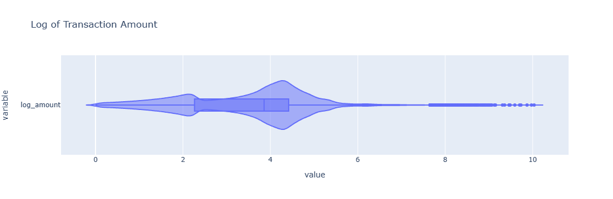
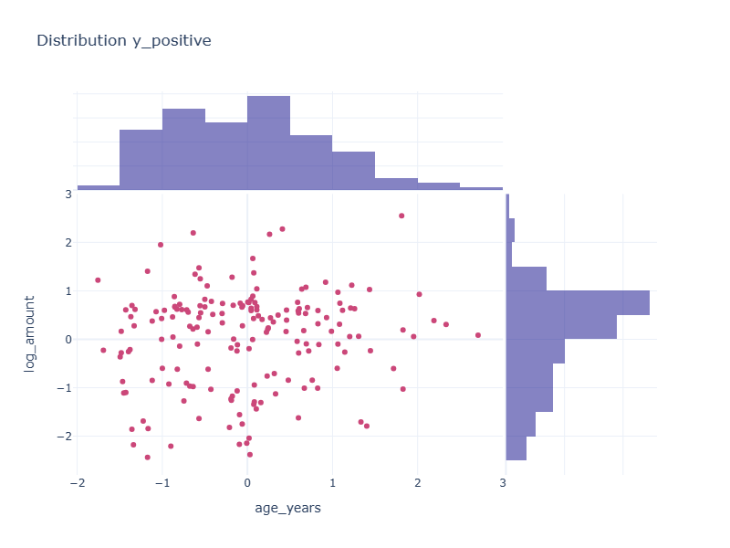
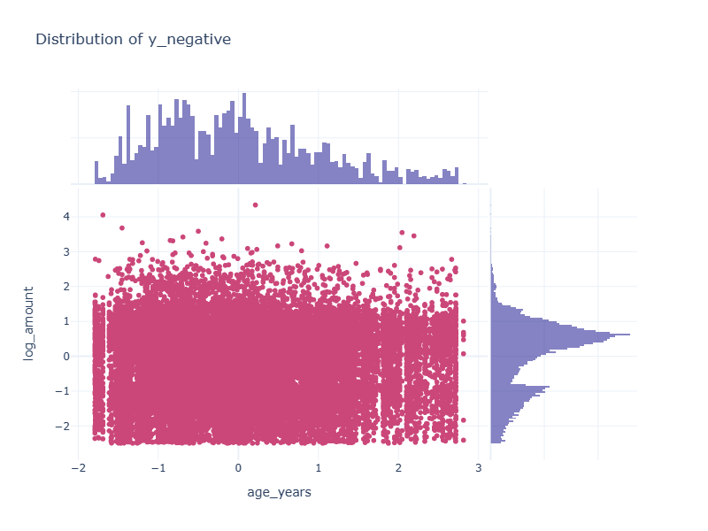
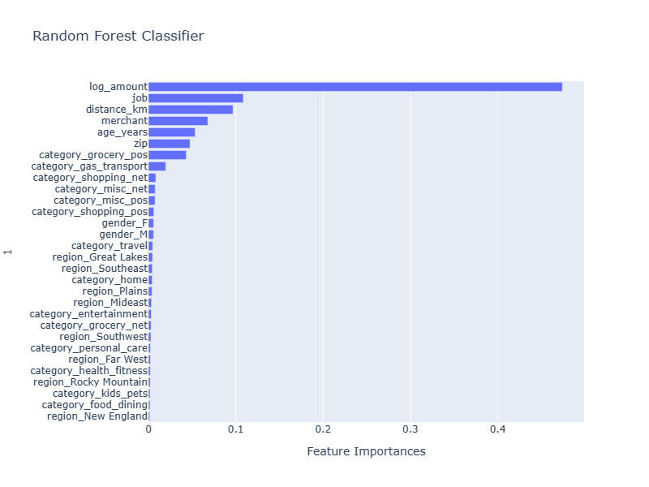
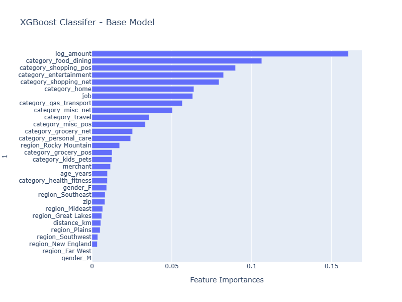
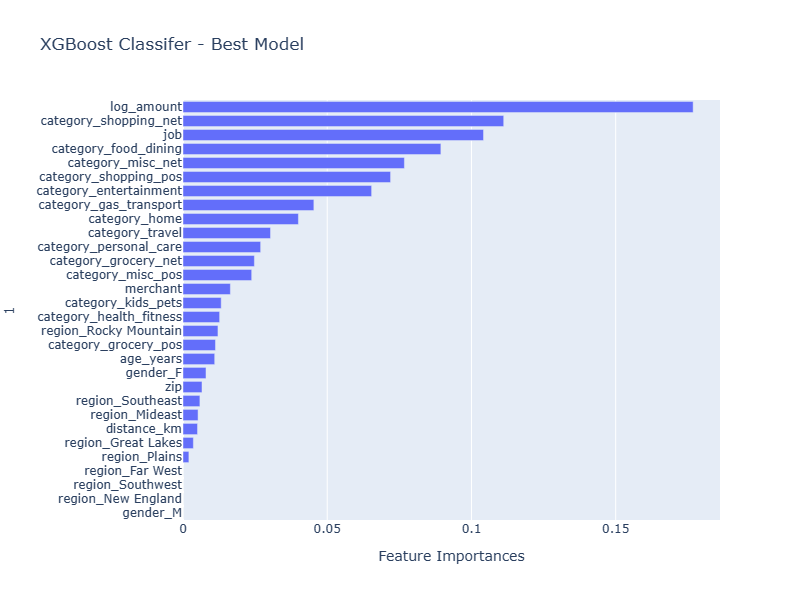

# Credit_Card_Fraud  
Credit Card Fraud Detection Project 4 Team 6  (Nesihlan Atar, John Ellis, Gurans Limbu, Daniel Morris)  
Dataset located on: 
[Kaggle](https://www.kaggle.com/datasets/kelvinkelue/credit-card-fraud-prediction)

## An Overview of the project and its purpose:  
To create a binary classification machine learning model to identify fraudulent transactions within a population of 555718 transactions.  The labelled dataset consisted of the following 22 features:  

1. Trans_date_trans_time: Timestamp of the transaction (date and time).  
2. Cc_num:Unique customer identification number.  
3. MerchantThe merchant involved in the transaction.  
4. Category Transaction type (e.g., personal, childcare). 
5. Amt:Transaction amount.  
6. First: Cardholder's first name.  
7. Last Cardholder's last name.  
8. Gender: Cardholder's gender.  
9. Street: Cardholder's street address.  
10. City: Cardholder's city of residence.
11. State: Cardholder's state of residence.
12. Zip: Cardholder's zip code.
13. Lat:Latitude of cardholder's location.
14. Long: Longitude of cardholder's location.
15. City_pop:Population of the cardholder's city.
16. Job:Cardholder's job title.
17. Dob: Cardholder's date of birth.
18. Trans_num: Unique transaction identifier.
19. Unix_time: Transaction timestamp (Unix format).
20. Merch_lat:Merchant's location (latitude).
21. Merch_long: Merchant's location (longitude).
22. Is_fraud:Fraudulent transaction indicator (1 = fraud, 0 = legitimate). This is the target variable for classification purposes.

The project was broken into 7 parts.
1.  Descriptive analysis:  a review of the features and how they relate to the target variable.
2.  Target variable review  
3.  Feature Engineering and Data Preprocessing   
4.  Selection of the objective metric(s) for model assessment.
5.  Assessing various types of machine learning algorithims with minimal tuning.
6.  Selecting "best" algorithim from the set of algroithims assessed for hyperparamater tuning.
7.  Tuning the chosen model for optimal performance
___
## Part 1 Descriptive Analysis  
___
## Part 2 Target Variable Review
The dataset consisted of 555718 transaction records of which 2145 were fraudulent (0.3860%).  The labels therefore are highly imbalanced and steps were taken to address the impact of this imbalance on the models.  

___
## Part 3 Feature Engineering and Data Preprocessing
After performing a descriptive analysis of the data a number of features were dropped or created then encoded/transformed and scaled:   
1. **Dropped Features**: 'First' Name, 'Last' Name, 'cc_num', 'street', 'city', 'state', 'dob', 'Trans_num', 'Unix_time', 'Lat', 'Long', 'Merch_lat', 'Merch_long'
2. **Created Features**: 'Region', an amalgamation of U.S. States according to the  [U.S. Bureau of Economic Analysis](https://www.bea.gov/). Age_years, the age of the cardholder based on the difference between today's date and the cardholders DOB. Distance_km, the distance between the cardholders latitude and longitude and the merchants latitude and longitude.
3. **Encoded Features with few categories**: binary or get_dummies encoding - 'catagories', 'gender', 'region'. 
4. **Transformed Features**: amt (Transaction Amount) due to the very high dispersion in this feature it was transformed by the natural log.  

5. The resulting data set was split into training and testing sets with 75% of the data used for training and 25% was used for testing.  Due to the very high imbalance in target labels (classes) the training and test splits were reviewed to ensure an adequate number of labels were assigned to each set.    
                `Average class probability in data set:     0.003860`  
                `Average class probability in training set: 0.003839`  
                `Average class probability in test set:     0.003923`  

6. **Encoding Features with Extensive Categories**: Target encoding - 'merchants', 'jobs' was applied after splitting the data into train and test sets.  The target encoder was just fit to the training data, the resulting encoder was applied to both the training and testing sets.
7. **Scaling**: Sci-kit Learns standard scaler was fit to the training features and both the training and testing features were transformed with the resulting scaler.   
___
## Part 4 Selection of the objective metrics for model assessment
As recommended by Scikit Learn[1] Balanced Accuracy is a more appropriate objective metric over accuracy when working with imbalanced classes in the target, as it weighs each sample according to the inverse prevlaence of its true class.  It is this metric that is used to assess each model's performance.
___
## Part 5 Assessing various machine learning algorithms.
The following models were reviewed for their ability to achieve a balanced accuracy score while maximizing the recall of the model.

### 1. Logistic Regression  
`         Confusion Matrix: LogisticRegression`  
`         Predicted Legitimate 0	Predicted Fraudulent 1`  
`Legitimate 0	138366	                   19`  
`Fraudulent 1	520	                    25`  
`Accuracy Score :         0.9961203483768805`  
`Balanced Accuracy Score: 0.5228671307577285`  
`                        Classification Report`  
`              precision    recall  f1-score   support`  

           0       1.00      1.00      1.00    138385
           1       0.57      0.05      0.08       545

`    accuracy                           1.00    138930`  
`   macro avg       0.78      0.52      0.54    138930`
`weighted avg       0.99      1.00      0.99    138930`

The logistic regression model as illustrated above has a mediocre performance when attempting to predict the fraudulent records in the test set as evidenced by the recall of 0.05 where approximately 1 in every 20 fraudulent transactions were detected.  This low performance is further illustrated by the 0.52 balanced accuracy score achieved.  Based on this result we moved onto a non-linear model.

### 2. Support Vector Machine with RBF kernel
`       Confusion Matrix: SVM with kernal rbf`  
`       Predicted Legitimate 0	Predicted Fraudulent 1`  
`Legitimate 0 138364	               21`  
`Fraudulent 1 410	               135`  
`Accuracy Score :          0.9968977182753905`  
`Balanced Accuracy Score:  0.6237773357336748`  
`                        Classification Report`  
`              precision    recall  f1-score   support`

`           0       1.00      1.00      1.00    138385`  
`           1       0.87      0.25      0.39       545`  

`    accuracy                           1.00    138930`  
`   macro avg       0.93      0.62      0.69    138930`  
`weighted avg       1.00      1.00      1.00    138930`  

The non-linear model chosen was based on a Support Vector Machine with the radial bias funtion (rbf) kernel.  The resulting algorithm resulted in a marginal (0.10) improvement in the balanced accuracy score and a 5x improvement in recall over the Logistic Regression Model above.  Although performing better there was definitely room to improve both the recall at 0.39 and balanced accuracy scores at 0.62.

### 3. Random Forest Classifier
`       Confusion Matrix: RandomForestClasssifer`  
`       Predicted Legitimate 0	Predicted Fraudulent 1`  
`Legitimate 0 138352	               33`  
`Fraudulent 1    208	           337`  
`Accuracy Score : 0.9982653134672137`  
`Balanced Accuracy Score: 0.8090550793508205`  
`                       Classification Report`  
`              precision    recall  f1-score   support`  

`           0       1.00      1.00      1.00    138385`  
`           1       0.91      0.62      0.74       545`  

`    accuracy                           1.00    138930`  
`   macro avg       0.95      0.81      0.87    138930`  
`weighted avg       1.00      1.00      1.00    138930`  

The random forest classifier generated the following feature importances:  
  
Next we reviewed an ensemble random forest model which was much more performant than the previous two models. With this model we started to see a more acceptable balanced accuracy score (0.81) but the model was able to predict fraudulent transacitons 62% of the time.

### 4. XGBoost with postive scaling of labels
`        Confusion Matrix: XGBoost Baseline Model`  
`        Predicted Legitimate 0 	Predicted Fraudulent 1`  
`Legitimate 0	137580	                 805`  
`Fraudulent 1	50	                  495`
`Accuracy Score :         0.9938458216367955`    
`Balanced Accuracy Score: 0.9512198881394911`  
`                       Classification Report`  
`              precision    recall  f1-score   support`  

`           0       1.00      0.99      1.00    138385`  
`           1       0.38      0.91      0.54       545`  

`    accuracy                           0.99    138930`  
`   macro avg       0.69      0.95      0.77    138930`  
`weighted avg       1.00      0.99      1.00    138930`  

Given the high target imbalance the XGBoost model with it's ability to accept a parameter which helps to compensate for the class imbalance, performs much better than the other algorothims considered.  The parameter [2]'scale_pos_weights' is set to the ratio of negative transactions to positive transactions. (sum(postive_y)/sum(negative_y)) or 259.0 which when applied removes the imbalance in the target classes.

## Part 6 Algorithm Selection
After reviewing the model results XGBoost was selected for hyper-parameter tuning because:
1. XGBoost has facilities to address imbalance in the target class.
2. XGBoost has a robust parameter framework to support tuning.
3. XGBoost showed the most promising results from the algorithms reviewed.
___
## Part 7 Tuning XGBoost and selecting the best model.
The parameters selected to be tuned were:  
1. The number of boosting rounds to run (32,64,128,256,512) 
2. The maximum depth of the trees created (2, 4, 6, 8, 10, 12)  
3. This results in 30 distinct models being evaluated.

The results were as follows:
1. From the 30 models run by the tuner, 6 (20%) of the models met the primary requirement of meeting 0.965 balanced accuracy.
2. From the 6 models 3 (50%) met the requirement of being within 1 standard deviation of the model with the highest balanced accuracy.
3. Of these 3 models the one with which rendered the fastest prediction was selected as the **BEST** model.  

The tuning objective was set to maximize the balance accuracy score and secondarily model precision.  Precision was chosen in an attempt to minimize the rate of false positives. 

`          Confusion Matrix: XGBoost Grid Search Best Model`   
`          Predicted Legitimate 0	Predicted Fraudulent 1`  
`Legitimate 0	135526	                2859`    
`Fraudulent 1	10	                  535`  
`Accuracy Score : 0.9793493126034694`  
`Balanced Accuracy Score: 0.9804958112803894`   
`                       Classification Report`  
`              precision    recall  f1-score   support`  

`           0       1.00      0.98      0.99    138385`  
`           1       0.16      0.98      0.27       545`  

`    accuracy                           0.98    138930`  
`   macro avg       0.58      0.98      0.63    138930`  
`weighted avg       1.00      0.98      0.99    138930`  

___
Footnotes:
[1]
[Scikit Learn Balanced Accuracy Score](https://scikit-learn.org/stable/modules/generated/sklearn.metrics.balanced_accuracy_score.html#sklearn.metrics.balanced_accuracy_score) 
[2]
[
The following data science and visualization technologies were used in creating this analysis:

  
  
  
  
  
